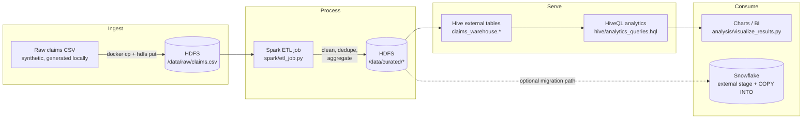
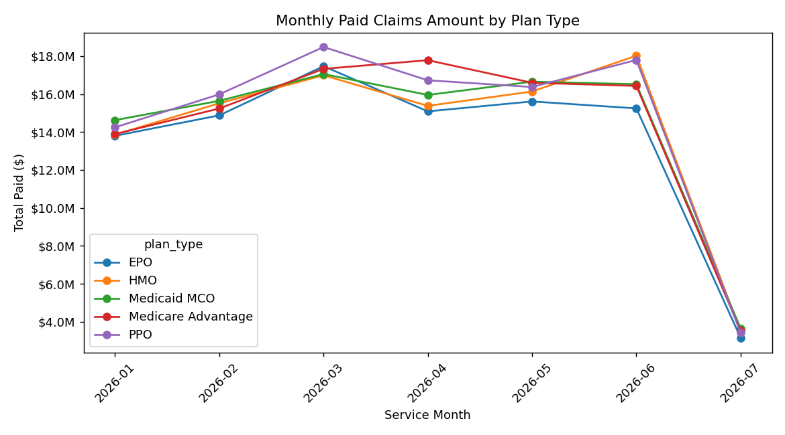
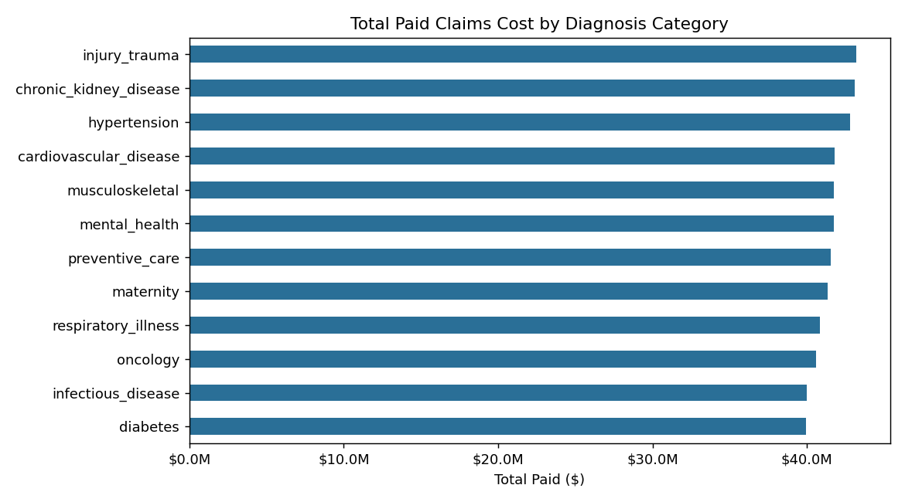
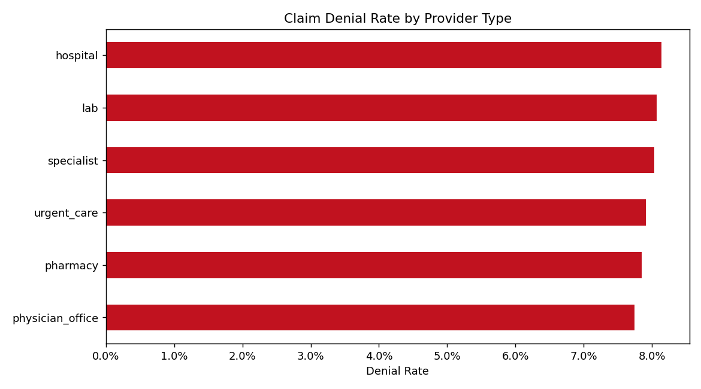
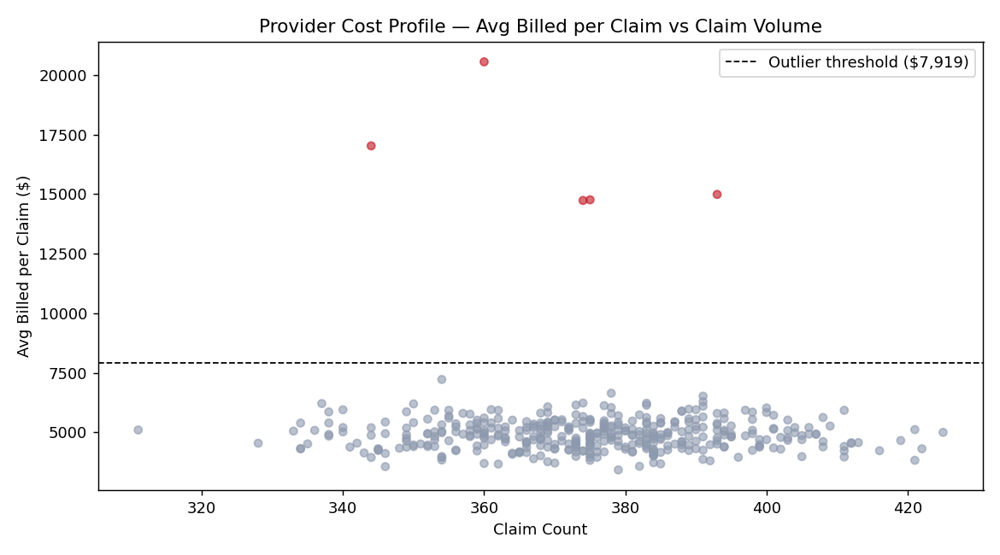
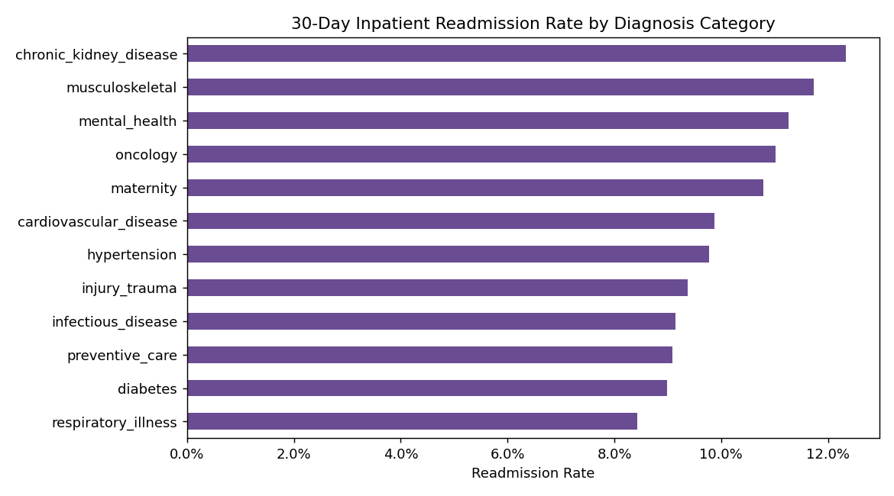

# Claims Analytics Pipeline on Hadoop

A health insurance claims analytics pipeline built on the Hadoop ecosystem: **HDFS → Spark (ETL) → Hive (SQL analytics)**, with a documented migration path to a cloud warehouse (Snowflake) as a bonus section.

All data is **synthetic**, generated by `data/generate_data.py`. Nothing in this repository is derived from real patient, member, or provider data — there is no PHI/PII anywhere in this project.

## Why this project, and why this architecture

Insurance claims analytics is one of the most authentic enterprise Hadoop use cases — payers built Hadoop data lakes for claims processing through the 2013–2019 era specifically because claims volume, retention requirements, and the mix of structured/semi-structured data suited HDFS + batch processing well. This project mirrors that shape: a raw claims feed lands in HDFS, Spark does the heavy-lift cleaning/aggregation, and Hive exposes the result as SQL tables an analyst can query directly.

## Architecture



Cluster topology (docker-compose): NameNode + DataNode (HDFS), ResourceManager + NodeManager + HistoryServer (YARN), Hive Metastore (Postgres-backed) + HiveServer2, Spark Master + Worker.

## Dataset

`data/generate_data.py` generates a synthetic claims feed: 8,000 members, 400 providers, 150,000 claims over a 180-day window. Each claim carries plan type, provider type, diagnosis category, procedure category, billed/allowed/paid amounts, claim status, and denial reason where applicable. ~3% of providers are deliberately seeded as cost outliers (2–4.5x normal billed amounts) so the outlier-detection logic has something real to find — this is a known-answer test built into the data generator, not just decoration.

Regenerate or scale the dataset:
```bash
python3 data/generate_data.py --num-members 8000 --num-providers 400 --num-claims 150000 --days 180 --out raw/claims.csv
```

## What's actually been tested, and what you need to verify yourself

Being direct about this rather than letting the repo imply more than it's proven:

- **Tested and verified in this environment:** the full `spark/etl_job.py` transformation logic, run locally via PySpark against the real 150K-row generated dataset. All six curated tables were produced correctly — the outlier detection flagged exactly the providers seeded as outliers in the data (5 of 400), and the aggregate numbers below were pulled from that actual run.
- **Not tested here (no Docker in this environment):** the `docker-compose.yml` multi-container HDFS/YARN/Hive/Spark cluster itself. It's built on the standard, widely-used `bde2020` reference images, but those images haven't been actively maintained since ~2021-2022. Run `docker compose pull` first — if any image fails to pull, check [hub.docker.com/u/bde2020](https://hub.docker.com/u/bde2020) for current tags or swap to official `apache/hadoop` images (note: different env var convention).
- **HiveQL syntax:** written to standard Hive syntax (window functions, `DATEDIFF`, partitioned external tables) but not executed against a live HiveServer2 in this environment. Low risk of syntax issues, but verify against your own cluster before treating it as gospel.

## Setup and run (on your machine, with Docker)

```bash
# 1. Bring up the cluster
docker compose up -d
# wait ~60s for HDFS/YARN/Hive to finish forming, or:
make up

# 2. Run the full pipeline: ingest → Spark ETL → Hive tables → analytics
make pipeline

# UIs while it's running:
#   NameNode UI:        http://localhost:9870
#   ResourceManager UI: http://localhost:8088
#   Spark Master UI:    http://localhost:8080
#   HiveServer2:        jdbc:hive2://localhost:10000
```

To iterate on the Spark logic without spinning up Docker at all:
```bash
pip install pyspark
make local-smoke-test
make charts
```

## Results (from the local PySpark run against the generated data)

- **Total paid claims:** $498.6M across 150,000 claims, 5 plan types (HMO, PPO, EPO, Medicare Advantage, Medicaid MCO)
- **Highest-cost diagnosis categories:** injury/trauma ($43.2M), chronic kidney disease ($43.1M), hypertension ($42.8M) — plausible spread given the data generator has no single dominant cost driver by design
- **Denial rate:** 7.7%–8.1% depending on provider type, consistent with the ~8% denial probability baked into the generator
- **Provider cost outliers:** 5 of 400 providers flagged, all matching the providers the generator seeded as anomalous (2–4.5x normal billing) — confirms the z-score outlier logic works as intended
- **30-day inpatient readmission rate:** ranges 8.4%–12.3% by diagnosis category

### Charts

| | |
|---|---|
|  |  |
|  |  |
|  | |

Regenerate charts: `make charts`

## Repository layout

```
hadoop-clickstream-pipeline/
├── docker-compose.yml       # Hadoop + YARN + Hive + Spark cluster (bde2020 images)
├── hadoop.env                # Shared Hadoop/Hive config for the cluster
├── Makefile                   # up / pipeline / local-smoke-test / charts
├── data/
│   └── generate_data.py       # Synthetic claims data generator
├── raw/
│   └── claims.csv               # Generated raw data (150K rows)
├── spark/
│   └── etl_job.py                # Core PySpark ETL — cleaning + 6 aggregate tables
├── hive/
│   ├── create_tables.hql          # External table DDL over curated Parquet
│   └── analytics_queries.hql       # PMPM, MoM trend, provider ranking, cohort queries
├── analysis/
│   ├── visualize_results.py         # Chart generation from ETL aggregate outputs
│   └── charts/                        # Generated PNGs
├── scripts/
│   ├── 01_ingest_to_hdfs.sh            # Land raw CSV into HDFS
│   ├── 02_run_etl.sh                    # spark-submit the ETL job on the cluster
│   ├── 03_create_hive_tables.sh          # Run create_tables.hql via beeline
│   └── 04_run_analytics.sh                # Run analytics_queries.hql via beeline
└── curated/                                 # Local smoke-test output (Parquet + CSV)
```

## Bonus: cloud migration path (Snowflake)

The uncomfortable truth about Hadoop in 2026: most organizations that built claims lakes this way have since migrated the serving layer to a cloud warehouse, keeping HDFS/Spark (or its successors) mainly for raw ingestion and heavy batch transforms. Demonstrating that you understand *both* sides of that migration is worth more than pure Hadoop depth alone.

The curated Parquet output (`/data/curated/*`) is already in a warehouse-friendly columnar format, so the migration is mechanical:

```sql
-- 1. Point an external stage at the exported curated data (e.g. after
--    copying HDFS output to S3/GCS/Azure Blob via distcp or hadoop fs -cp)
CREATE OR REPLACE STAGE claims_stage
  URL = 's3://your-bucket/curated/claims/'
  STORAGE_INTEGRATION = your_s3_integration
  FILE_FORMAT = (TYPE = PARQUET);

-- 2. Load into a native Snowflake table
CREATE OR REPLACE TABLE claims_warehouse.claims (
  claim_id STRING, member_id STRING, provider_id STRING, provider_type STRING,
  plan_type STRING, member_age_band STRING, member_state STRING, claim_type STRING,
  diagnosis_category STRING, procedure_category STRING, service_date DATE,
  submission_date DATE, billed_amount FLOAT, allowed_amount FLOAT, paid_amount FLOAT,
  claim_status STRING, denial_reason STRING, is_readmission_within_30d BOOLEAN,
  service_month STRING
);

COPY INTO claims_warehouse.claims
  FROM @claims_stage
  MATCH_BY_COLUMN_NAME = CASE_INSENSITIVE;

-- 3. The same PMPM / denial-rate / readmission queries from
--    hive/analytics_queries.hql run essentially unchanged here —
--    that's the point of keeping the curated layer in Parquet.
```

This section is illustrative SQL, not executed against a live Snowflake account — treat it as a starting point, not a tested script.

## What I'd add for production

Being honest about the gaps rather than presenting this as more finished than it is: no orchestration layer (Airflow/Dagster) — the Makefile is a stand-in for a DAG scheduler; no data quality framework (Great Expectations or dbt tests) validating the curated tables beyond the assertions baked into the ETL job; no incremental/CDC ingestion — the pipeline does a full reload each run; no real fraud-detection model, just a z-score cost-outlier heuristic; and no access control/row-level security story, which matters a lot more in healthcare data than in the generic clickstream case this project started as.
